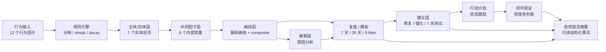
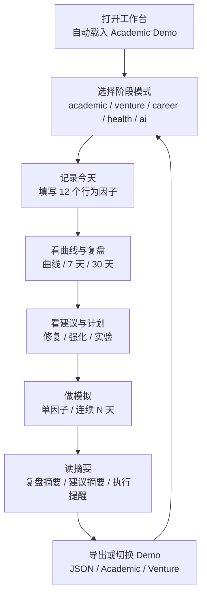

# Showcase Diagrams

本文件用于公开展示准备阶段，先用 Markdown / Mermaid 描述 README 或展示页可用的配图素材。后续如果需要正式图片，可以基于这些结构导出 SVG 或 PNG。

## 系统架构图建议

用途：说明 Life Curve Engine 的核心不是“预测人生”，而是把行为记录转成可解释的状态、曲线、建议和验证。

## 用户工作流图建议

用途：放在 README 或展示页中，让第一次打开项目的人知道如何操作工作台。

## README 配图落点

- 第一张：系统架构图，放在“核心链路”之后。
- 第二张：用户工作流图，放在“当前工作台主流程”之后。
- 可选第三张：一张桌面端工作台截图，展示曲线、复盘、建议和模拟同时可见。
- 可选第四张：一张移动端截图，证明主流程在窄屏下仍可阅读。
